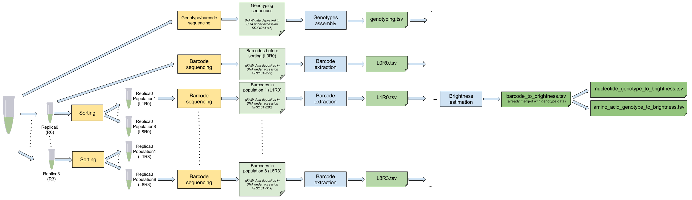

# SmoothProt
Improving Protein Fitness Predictions with Graph-Based Smoothing and Gaussian Process Regression

## Overview

Protein fitness landscapes are notoriously rugged: small changes in sequence can produce large, seemingly random changes in function. SmoothProt addresses this by imposing **graph-based Laplacian smoothing** on raw experimental fluorescence measurements before fitting a **Gaussian Process (GP) surrogate model**. The smoothed landscape is easier to learn and explore, which improves downstream fitness predictions and sequence optimisation.

The full pipeline is illustrated below:



## Repository Structure

```
SmoothProt/
├── Data_flow.png                        # Pipeline diagram
├── README.md
├── src/
│   ├── data_preprocessing.py            # Translate nucleotide → protein; build mutation vectors
│   ├── graph_based_smoothing.py         # Laplacian smoothing on the mutation graph
│   ├── gp_regression.py                 # Gaussian Process regression + diagnostic plots
│   ├── gwg_trace.py                     # Gibbs-with-Gradients MCMC sampler
│   ├── landscape.py                     # t-SNE / 3-D PCA / UMAP / hill-climbing / Bayes-opt plots
│   └── umap_plot.py                     # Side-by-side UMAP: raw vs smoothed fluorescence
└── output/
    ├── processed_gfp_1000.csv           # Pre-processed GFP variants (1000 samples)
    ├── processed_gfp_1000_smoothed.csv  # After graph-smoothing
    ├── processed_gfp_1000_smoothed_gp.csv  # After GP regression (includes gp_mean / gp_std)
    ├── gp_model.pkl                     # Serialised GPR model
    └── plots/                           # All generated figures
```

## Requirements

Install the required Python packages (Python ≥ 3.9 recommended):

```bash
pip install pandas numpy scipy scikit-learn matplotlib umap-learn joblib
```

## Data

Two raw data files are required and should be placed in a `data/` directory at the repository root:

| File | Description |
|------|-------------|
| `data/avGFP_reference_sequence.fa` | Wild-type avGFP nucleotide sequence in FASTA format |
| `data/nucleotide_genotypes_to_brightness.tsv` | Sarkisyan et al. GFP mutagenesis dataset (TSV with columns `aaMutations` and `medianBrightness`) |

## Usage

Run the scripts in order from within the `src/` directory.

### 1. Data Pre-processing

Translates the WT nucleotide sequence to amino acids, applies the mutations listed in the TSV, and produces a binary mutation-vector representation alongside the raw fluorescence values.

```bash
cd src
python data_preprocessing.py
```

Key arguments:

| Argument | Default | Description |
|----------|---------|-------------|
| `fasta_path` | `../data/avGFP_reference_sequence.fa` | WT FASTA file |
| `tsv_path` | `../data/nucleotide_genotypes_to_brightness.tsv` | Mutagenesis dataset |
| `sample_size` | `1000` | Number of variants to sample |
| `out_csv` | `../output/processed_gfp_1000.csv` | Output CSV |

**Output:** `output/processed_gfp_1000.csv` — columns: `amino_acid_sequence`, `mutation_vector`, `mutation_count`, `log_fluorescence`.

---

### 2. Graph-Based Smoothing

Constructs a mutation graph (nodes = sequences, edges = Hamming distance 1) and solves the Tikhonov-regularised system **(I + λ·L) f̂ = y** to smooth the fluorescence signal across neighbours.

```bash
python graph_based_smoothing.py [--csv ../output/processed_gfp_1000.csv] [--alpha 10.0] [--out ...]
```

| Argument | Default | Description |
|----------|---------|-------------|
| `--csv` | `../output/processed_gfp_1000.csv` | Pre-processed input CSV |
| `--alpha` | `10.0` | Regularisation strength λ (larger → smoother) |
| `--out` | `<csv>_smoothed.csv` | Output CSV path |

**Output:** `output/processed_gfp_1000_smoothed.csv` — adds a `smooth_fluorescence` column.

---

### 3. Gaussian Process Regression

Fits a GPR (RBF + WhiteKernel) on the smoothed fluorescence values with a small cross-validation grid search. Outputs predictions and optional diagnostic plots.

```bash
python gp_regression.py [--csv ...] [--out_csv ...] [--model ...] [--plots] [--plot_dir ...] [--umap]
```

| Argument | Default | Description |
|----------|---------|-------------|
| `--csv` | `../output/processed_gfp_1000_smoothed.csv` | Smoothed input CSV |
| `--out_csv` | `../output/processed_gfp_1000_smoothed_gp.csv` | Predictions output CSV |
| `--model` | `../output/gp_model.pkl` | Path to save the fitted model |
| `--plots` | `True` | Generate diagnostic plots |
| `--plot_dir` | `../output/plots` | Directory for plots |
| `--umap` | `True` | Include UMAP visualisation |

**Output:** `output/processed_gfp_1000_smoothed_gp.csv` — adds `gp_mean` and `gp_std` columns.  
**Plots:** `scatter_true_vs_pred.png`, `residuals_hist.png`, `pca_fitness.png`, `umap_fitness.png`.

---

### 4. GWG Sampler (Gibbs-with-Gradients)

Runs a Markov chain over the 1000 sequences, proposing moves to Hamming-1 neighbours with weights proportional to **exp(ΔGP_mean / T)**. The chain targets high-fitness regions of the landscape.

```bash
python gwg_trace.py [--gp_csv ...] [--steps 1000] [--T 0.3] [--start None] [--out_dir ../output]
```

| Argument | Default | Description |
|----------|---------|-------------|
| `--gp_csv` | `../output/processed_gfp_1000_smoothed_gp.csv` | GP-annotated CSV |
| `--steps` | `1000` | Number of MCMC steps |
| `--T` | `0.3` | Sampling temperature |
| `--start` | random | Index of the starting sequence |
| `--out_dir` | `../output` | Directory to write the trace CSV |

**Output:** `output/gwg_trace_T<T>.csv` — columns: `step`, `index`, `gp_mean`, `mutation_cnt`, `sequence`.

---

### 5. Landscape Visualisation

Generates a comprehensive set of plots comparing raw and smoothed landscapes.

```bash
python landscape.py [--raw_csv ...] [--smoothed_csv ...] [--gp_csv ...] [--plots_dir ...] [--ucb_k 2.0]
```

**Plots produced:**

| File | Description |
|------|-------------|
| `tsne.png` | 2-D t-SNE embedding coloured by smoothed fluorescence |
| `3d_pca.png` | 3-D PCA projection |
| `3d_umap.png` | 3-D UMAP projection |
| `hamming_heatmap_raw.png` | Pairwise Hamming distance vs raw fluorescence difference |
| `hamming_heatmap_smooth.png` | Same heatmap for smoothed fluorescence |
| `hill_climb.png` | Hill-climbing trajectories on raw vs smoothed landscape |
| `bayes_opt.png` | Bayesian optimisation (UCB) simulation |

---

### 6. UMAP Comparison Plot

Renders a side-by-side UMAP embedding showing raw log-fluorescence versus smoothed fluorescence, and prints correlation statistics.

```bash
python umap_plot.py [--csv ../output/processed_gfp_1000_smoothed.csv] [--seed 42]
```

**Output:** `output/plots/umap_raw_vs_smooth.png`.

**Console metrics:**
- Pearson *r* between raw and smoothed values
- Mean absolute change per variant
- Fraction of variants shifting more than one decile in rank

## Output Files Summary

| File | Produced by | Description |
|------|-------------|-------------|
| `output/processed_gfp_1000.csv` | `data_preprocessing.py` | Pre-processed variants |
| `output/processed_gfp_1000_smoothed.csv` | `graph_based_smoothing.py` | Graph-smoothed fluorescence |
| `output/processed_gfp_1000_smoothed_gp.csv` | `gp_regression.py` | GP mean and std predictions |
| `output/gp_model.pkl` | `gp_regression.py` | Serialised GPR model |
| `output/gwg_trace_T<T>.csv` | `gwg_trace.py` | GWG sampler trajectory |
| `output/plots/` | `gp_regression.py`, `landscape.py`, `umap_plot.py` | All diagnostic figures |

